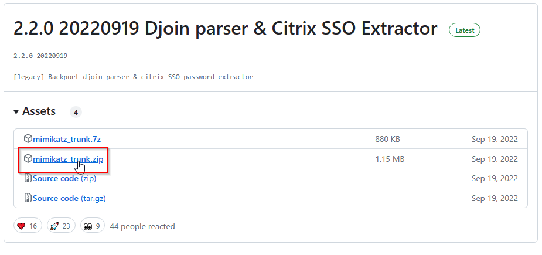
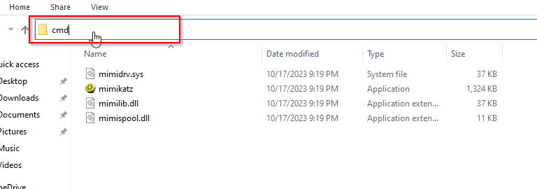
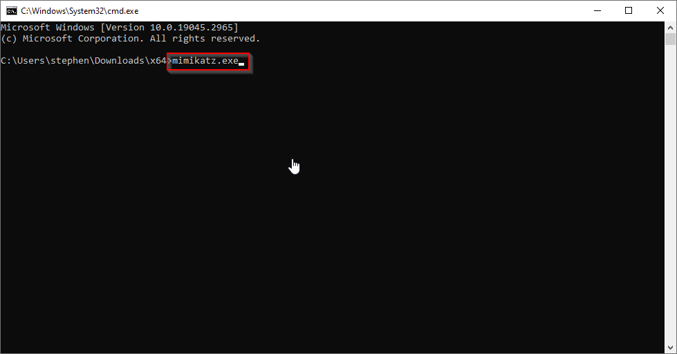
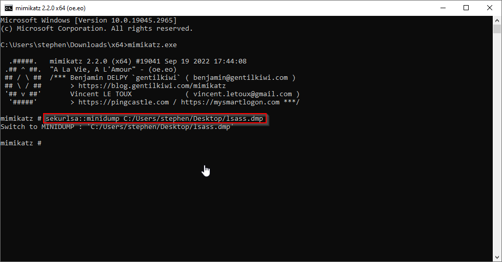
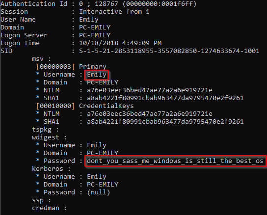

# Don't Lsass me

## File Type && Stratgy
After downloading the file we see it is named lsass.dmp. Lsass is typically used in windows authentication and knowing that the description is asking for a password of a user I think we should use the tool mimikatz.

## Launching Mimikatz
**Windows defender and chrome/edge smart screen will try to block this program. You have to allow it to run**
1. [Download Mimikatz binaries](https://github.com/gentilkiwi/mimikatz/releases)(It only works on windows machines) - go to the link by pressing download mimikatz then click on the option that says mimikatz_trunk.zip\

2. Extract Mimikatz - Double click on the file you just downloaded. Then drag the x64 folder to your downloads folder.\

3. Open the folder we extracted\

4. Open terminal. Click on the path of the folder then type cmd, then press enter.\

5. Launch Mimikatz Program
```bash
mimikatz.exe
```

\
7. Open File - We need to tell mimikatz where to look for our dump file\
```bash
sekurlsa::minidump /path/to/dump
```

\
8. Launch Attack
```bash
sekurlsa::logonPasswors
```
 
\
9. Flag - Looking through the output we see a block of text with the username of Emily and scrolling down we find the password which looks like the flag\
 
```bash
dont_you_sass_me_windows_is_still_the_best_os
```

## Further Reading
[Ways to get lsass dumps](https://crypt0ace.github.io/posts/Dumping-Lsass/#:~:text=Mimikatz%20is%20a%20very%20popular,extract%20the%20plain%20text%20passwords.) \
[Mimikatz Hatricks Guide](https://book.hacktricks.xyz/windows-hardening/stealing-credentials/credentials-mimikatz)
